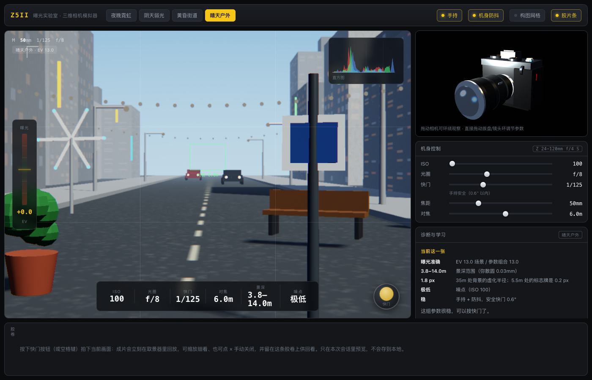

# 曝光实验室 · 三维相机模拟器

> 一个纯离线的单页网页应用，用可交互的三维相机把**曝光三角（ISO / 光圈 / 快门）**讲清楚。
> 机身与镜头参数对齐 **Nikon Z5II + NIKKOR Z 24-120mm f/4 S**。
> 无构建步骤、无后端、无依赖安装——打开 `index.html` 就能用。

**在线访问：** https://kevinweiboo.github.io/z5ii-3d-camera/



---

## 它解决什么问题

新手看教程时最常见的卡点是：ISO、光圈、快门三个数字互相牵制，改一个另外两个就得跟着动，纯靠文字很难建立直觉。
这个模拟器把三者的**因果链**直接画出来——你动任何一个，取景器里的画面亮度、噪点、景深、抖动**立刻**跟着变，同时右侧给出人话诊断。

- 调大光圈 → 画面变亮，背景开始虚化（景深条会告诉你虚化范围）
- 拉高 ISO → 画面变亮，但暗部开始冒彩色噪点、颗粒变粗
- 放慢快门 → 画面变亮，但手持下开始糊（会提示"安全快门"在哪）
- 三个一起动 → 曝光值回到 0.0 EV，但"干净程度"完全不同

---

## 四个光照场景

场景亮度用 **EV₁₀₀** 表示，与你的参数**无关**——它只由"现在有多亮"决定。曝光误差 = 场景 EV − 相机 EV。

| 预设 | 场景 EV₁₀₀ | 特征 | 建议起手式 |
|---|---|---|---|
| 夜晚霓虹 | 5.5 | 路灯与霓虹，天空深蓝 | f/4 手持约需 ISO 1600–6400，或上脚架长曝 |
| 阴天弱光 | 7.5 | 阴天傍晚 / 宽敞室内 | f/4 手持约需 ISO 400–1600 |
| 黄昏街道 | 9.5 | 蓝调时刻，天空与灯光亮度接近 | 最好拍的时段，可玩性最高 |
| 晴天户外 | 13.0 | 阳光明媚 | ISO 100 + f/8 + 1/125 即标准正确曝光 |

---

## 怎么用

**在线版**：点开链接就能用，手机浏览器也做了竖屏适配。

**本地版**：直接双击 `index.html`。不需要装任何东西，也不需要联网（Three.js 已放在 `vendor/` 里）。

**操作**

| 想做什么 | 怎么做 |
|---|---|
| 调参数 | 拖右侧滑块，或**直接拖三维机身上的拨盘 / 镜头环** |
| 环绕看机身 | 在三维机身区域拖动 |
| 拍一张 | 点取景器右下角的快门按钮，或按 <kbd>空格</kbd> |
| 看细节 | 拍完立刻回放，滚轮缩放、按住拖动、双击复位 |
| 关掉回放 | 点 <kbd>×</kbd> 或按 <kbd>Esc</kbd> |
| 换场景 | 点顶栏的预设按钮 |

**关于照片**：按快门只会把成片**渲染到页面里预览**，并留在底部胶卷上供本次会话回看。
**不会写入本地文件，也不会用浏览器的下载 / 存储接口**——这是刻意设计的，只为教学演示。

---

## 参数范围（对齐真实器材）

| 项目 | 范围 | 说明 |
|---|---|---|
| ISO | 100 – 64000 | 29 档，1/3 EV 步进 |
| 光圈 | f/4 – f/22 | 16 档（镜头最大 f/4 恒定），1/3 EV 步进 |
| 快门 | 1/8000 – 30 秒 | 54 档，1/3 EV 步进 |
| 焦距 | 24 – 120 mm | 可变焦，影响视角与景深 |
| 对焦距离 | ~0.3 m – 无穷远 | 配合景深公式算出清晰范围 |
| 传感器 | 全画幅 36 × 24 mm | 容许弥散圆取 0.03 mm |
| 机身防抖 | 约 **5 档**（保守估计） | Z5II 官方标称 7.5 档，这里取保守值，避免给你过于乐观的安全快门 |

---

## 物理模型

核心公式都在 `js/optics.js` 里，没有黑箱：

```
相机曝光值   EV_cam = log2(N² / t) − log2(ISO / 100)      N=光圈, t=快门秒数
曝光误差     ΔEV    = EV_scene − EV_cam                   >0 过曝, <0 欠曝
景深         用精确弥散圆(CoC)公式算，而非近似表
安全快门     1/焦距 为基准，开启防抖后放宽 VR_STOPS 档
抖动         超出安全快门后按档数换算成角度偏移，在渲染里真实呈现
```

因此"过曝 1 档"和"ISO 翻一倍"在画面上是**可加**的——这才是理解曝光补偿的关键。

---

## 目录结构

```
3d相机/
├── index.html              页面骨架 + 运行时错误兜底（出问题会显示出来，而不是只给你黑屏）
├── css/style.css           布局与视觉，含手机竖屏断点（≤900px 转单列）
├── js/
│   ├── optics.js           曝光三角 / 景深 / 防抖的物理模型 + 场景与档位表
│   ├── scene.js            四套光照场景（天空、太阳、灯光）
│   ├── pipe.js             WebGL 多通道后处理：曝光 → 景深 → 噪点/颗粒 → 抖动 → 直方图
│   ├── cam3d.js            可交互的三维机身（拨盘、镜头环拖动）
│   ├── ui.js               滑块、直方图、曝光表、诊断文字
│   └── main.js             主循环与窗口缩放
├── vendor/three.min.js     Three.js r150（UMD，离线内置）
├── preview/                各场景与线上版实测截图
└── 发布到GitHub.command     双击即可发布到 GitHub Pages（macOS）
```

---

## 浏览器要求

需要支持 WebGL 的现代浏览器（Chrome / Edge / Safari / Firefox 近几年版本都可以）。
如果显卡被禁用或驱动异常，页面顶部的错误条会把原因写出来，不会静默黑屏。

---

## 如何更新线上版本

```bash
git add -A && git commit -m "说明" && git push
```

GitHub Pages 会在 1–2 分钟内自动重新构建。首次发布（或换了机器）可以双击 `发布到GitHub.command`，
它会在浏览器里走一次 GitHub 官方设备码授权，之后凭证存在你自己的钥匙串里。

---

## 说明

这是为个人学习做的教学工具，物理模型力求正确但做了性能取舍；合成画面用于建立直觉，不能替代实拍。
